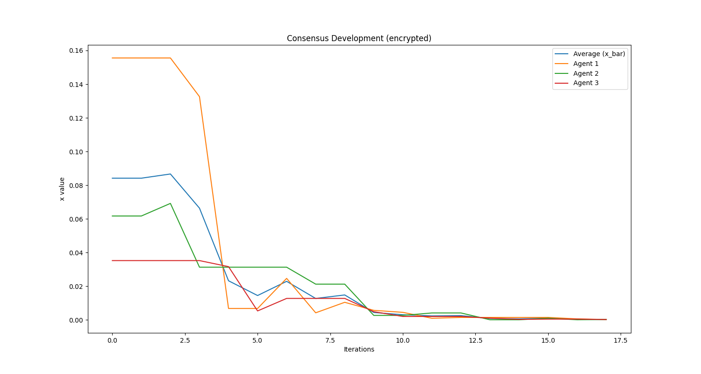

# Encrypted Consensus Problems

### Secure and Private Control - Assignment II

To run the simulations, simply run the `main.py` file. All classes and code is contained
in that file. You will find different experiments that are run at the bottom of the file.

```commandline
python main.py
```

Results of the experiments in terms of figures are opened while the experiment runs. Log
messages will also appear in the CLI for better understanding. The figures are saves in 
the location `/figrues/*`.

### Results of Experiments

We ran experiments on consensus problems with encrypted and not-encrypted communication 
between a `TrustedParty` and `Agents` (those classes are modelled in the main file). As
you can see in the following figure, the agents reach consensus. The weird-shaped plots
arise from a simulation of different clock speeds. The agents update their value only if
`random.random() > 0.5`, thus also not updating in some iterations. This way, we also 
model more real-world conditions.  

