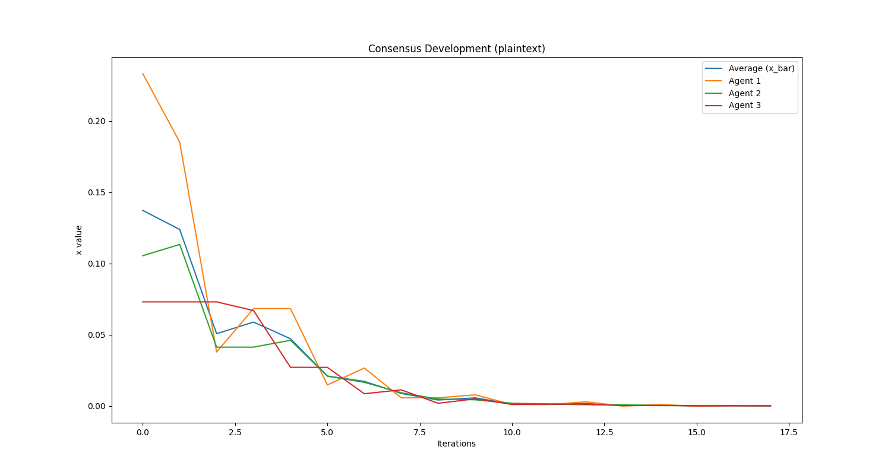

# Encrypted Consensus Problems

### Secure and Private Control - Assignment II

To run the simulations, simply run the `main.py` file. All classes and code is contained
in that file. You will find different experiments that are run at the bottom of the file.

```commandline
python main.py
```

Results of the experiments in terms of figures are opened while the experiment runs. Log
messages will also appear in the CLI for better understanding. The figures are saves in 
the location `/figrues/*`.

### Running Experiments

At the bottom of `main.py`, you will find three experiment function calls that look like
the following. You can simple comment in our out what experiment you want to run. The
parameter `include_rng` stands for `RandomNumberGenerator` and introduces the third party
which sends random numbers for 1-time pad to the agents via OT.

```python
# Create an experiment
experiment = Experiment()

# Create a variable with the agents configuration
agents_setup = [{'x': 1, 'q': 1}, {'x': 0.3, 'q': 1}, {'x': 0.1, 'q': 1}]

# Run the plaintext experiment
experiment.run_experiment(agents_setup, max_iters=18, encrypted=False)

# Run the encrypted experiment
experiment.run_experiment(agents_setup, max_iters=18, encrypted=True)

# Run the encrypted experiment where also the agent does not trust the trusted party
experiment.run_experiment(agents_setup, max_iters=18, encrypted=True, include_rng=True)
```

When running (e.g. here, the third experiment) the experiments, you will see console output
which indicates what is currently happening. 

```commandline
Started Experiment
Setting up the trusted party and the agents ...
Pubkey and hashes published.
Polynomial published.
Polynomial published.
Polynomial published.
G has been published.
G has been published.
G has been published.
Computing Step 0/18 ...
Computing Step 1/18 ...
Computing Step 2/18 ...
Computing Step 3/18 ...
Computing Step 4/18 ...
Computing Step 5/18 ...
Computing Step 6/18 ...
Computing Step 7/18 ...
Computing Step 8/18 ...
Computing Step 9/18 ...
Computing Step 10/18 ...
Computing Step 11/18 ...
Computing Step 12/18 ...
Computing Step 13/18 ...
Computing Step 14/18 ...
Computing Step 15/18 ...
Computing Step 16/18 ...
Computing Step 17/18 ...
Experiment 1 took 58.31 s
```

### Results of Experiments

We ran experiments on consensus problems with encrypted and not-encrypted communication 
between a `TrustedParty` and `Agents` (those classes are modelled in the main file). As
you can see in the following figure, the agents reach consensus. The weird-shaped plots
arise from a simulation of different clock speeds. The agents update their value only if
`random.random() > 0.5`, thus also not updating in some iterations. This way, we also 
model more real-world conditions.  

#### Experiment 1



The update of the agents internal state `x_i` is only done with a 80% probability
to also model real conditions where messages might be delayed sometime or don't get
delivered at all. A proper way would have been to use `threading` to let them run 
in parallel but we took this approach. 

#### Experiment 2


Clearly, the introduction of Pallier encryption in the second experiment boosted the
duration of the experiment. In the first experiment, the setup (and allocation of memory)
took longest, while in the second experiment we see much more activity in the 
computation of the consensus problem.

#### Experiment 3


In the third experiment, also introduce OT and another party, the RandomNumberGenerator
that produces a vector of random numbers for a 1-time pad for the agents internal value
to obscure it and not show it to the (now also untrusted) trusted party. We see a further
delay in the setup (generation of hashes etc.) of OT. In the computation, the duration
is a about the same. However, Experiment 2 took about `40s` and Experiment 3 took about `1 min`
which makes the differences visible. 